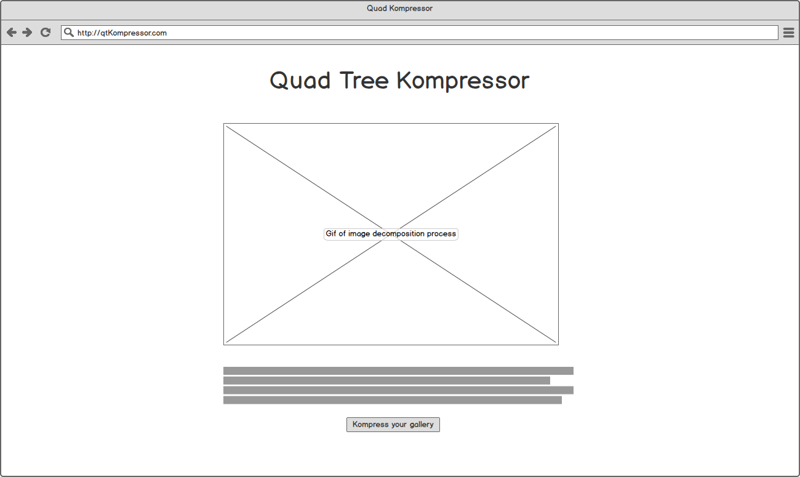
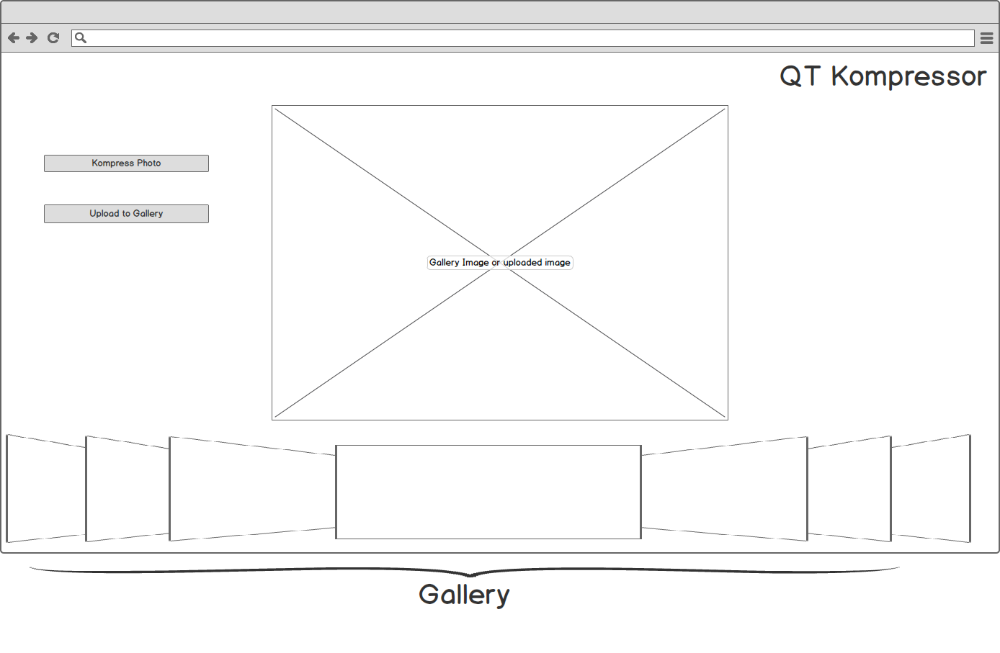

# QuadKompressor

## Collaborators

James Conklin & Michael Loren Loschiavo

[Trello Board](https://trello.com/b/Gjr0s6xz)

[Live View]()

## Overview

QuadKompressor will allow users to upload their own image to the application
through the Cloudinary API and key a list of such uploads to a given user with data stored in user cookies. It will utilize a quad-tree data structure to decompose and normalize an image by like color

## MVP Features

- [ ] Cloudinary Upload
- [ ] Minimal Node.js back-end to bootstrap Cloudinary API
- [ ] Gallery view of user images below compressor component.
- [ ] Compression of uploaded images using quad-tree structure.

## Wire-frames

**Landing Page**

**App Page**

## Implementation

### Libraries & Techniques
Both collaborators have prior experience working with the Cloudinary API, and we foresee little trouble integrating it into this project.

While we have not implemented back-ends in Node.js previously, the application requires minimal back-end functionality, so we identify this as a good opportunity to learn the library.

The front-end will be implemented within the React/Redux framework. Between us, we've enough experience that we foresee little issue here, as well.

Research will be needed to understand the quad tree implementation, i.e. traversal, insertion, & invariants.
We will need to review statistical variance to figure out how to assess whether an image quadrant needs to be further decomposed by the QT.

We will need to learn the D3.js library for rendering. Dividing images strongly suggests a need for vector graphics and we've found examples within the endorsed example list suggesting suitability for this project.  

### Schedule

- **Day 1-3:** Set up dev environment and install appropriate node packages. Learn enough node.js to accomplish minimal back-end server with Cloudinary API key bootstrapping, interact with a single-table MongoDB database, and expose a simple API for fetching image urls from and posting them to the DB.

- **Day 4-5:** React/Redux setup with Cloudinary integration. Our front-end app should allow image upload, gallery display, and store and retrieve user image urls by a token in the cookie.

- **Day 6** Research QT data structure and verify applicability of calculating statistical variance for colors.

- **Day 7-8** Implement QT image decomposition algorithm and rendering algo progress.

- **Day 9+:** Styling, bug-hunting and squashing.

## Post-MVP Enhancements

 - [ ] Camera integration
   - [ ] Change name to "Hello-QT"
 - [ ] Histogram of decomposed colors
 - [ ] Postprocessing/Filters
   - Grayscale
   - Variable tolerance
   - Render as bitmap.
