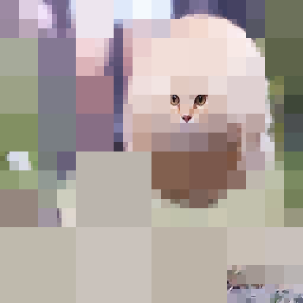
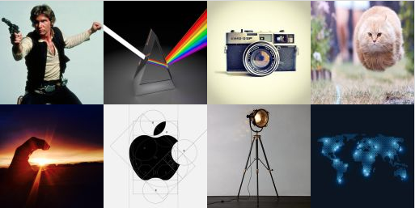

# QTKompressor

[Live Site](https://qtkompressor.herokuapp.com)

QTKompressor is an application created to demonstrate the workings of the [quadtree](https://en.wikipedia.org/wiki/Quadtree) data structure. By recursively decomposing an image into quadrants by similar colors ,it can render a compressed version of the image. When breaking down based on looser thresholds, these flattened regions are illustrative of the underlying structure.




## Features and Implementation
 - Compression
 - Rendering
 - Gallery
 - Backend
 - Image Upload

### Compression

We load an image from Cloudinary into a floating image element. When complete, it paints itself onto a canvas element and triggers first a reading of each pixel's RGB values into an array and then a building of a new quadtree for the scanned pixels. Each `QTNode` is inserted with `x`, `y`, and `dim` variables that define the region of the image it contains.

 When built, each node scans through the pixels in its domain once to determine the average color vector and again to determine chromatic variance. Chromatic variance should be understood as standard statistical variance, i.e. the average squared distance of a pixel to the average.
 ```math
E((R-R_avg)^2 + (G-G_avg)^2 + (B-B_avg)^2).
 ```

 <!-- Code snippet: Avg/Variance passes -->
```js
chromaticDifference(v1, v2) {
  let redDiff = Math.pow(v1.red-v2.red, 2),
      greenDiff = Math.pow(v1.green-v2.green, 2),
      blueDiff = Math.pow(v1.blue-v2.blue, 2);

  let diff = redDiff + greenDiff + blueDiff;
  return diff;
}

chromaticAnalysis(pixels, x0, y0, dim) {
  let redBar = 0, greenBar = 0, blueBar = 0;

  for (var x = x0; x < x0+dim; x++) {
    for (var y = y0; y < y0+dim; y++) {
      let { red, green, blue } = pixels[x][y];
      redBar += red; greenBar += green, blueBar += blue;
    }
  }
  let count = Math.pow(dim, 2);
  redBar /= count;
  greenBar /= count;
  blueBar /= count;

  let colorBar = {
    red: redBar,
    green: greenBar,
    blue: blueBar
  };

  let summedSquares = 0;

  for (var x = x0; x < x0+dim; x++) {
    for (var y = y0; y < y0+dim; y++) {
      summedSquares += this.chromaticDifference(colorBar, pixels[x][y]);
    }
  }
  return {
    average: colorBar,
    variance: summedSquares / count
  };

}

```

If the calculated variance is below a certain threshold, the node and its contained region are assigned the average color vector to be painted in on rendering. If instead the variance is above a given threshold, the node divides its region in four and inserts a child for each quadrant. The process then repeats until all children contain a chromatically uniform region, even if that leaves them with a single pixel.

<!-- Code snippet: branching out or terminating in leaf -->

```js
//Inside QTNode constructor
if ( variance > this.threshold) {
  this.children.push(new QTNode(pixels, x, y, dim/2, this.threshold));
  this.children.push(new QTNode(pixels, x+dim/2, y, dim/2, this.threshold));
  this.children.push(new QTNode(pixels, x+dim/2, y+dim/2, dim/2, this.threshold));
  this.children.push(new QTNode(pixels, x, y+dim/2, dim/2, this.threshold));
} else {
  this.color = average;
}
```

Once the tree has finished branching out, we've enough information to render the compressed image.

### Rendering

To render our quadtree, we traverse it, painting leaf regions with their average color and mapping recursive `draw(ctx)` calls to the children of any parent nodes. We opted to do this with timeouts to allow the app to progressively paint multiple regions of the map at once in a loosely coordinated manner.

Within each parent node, we set different timeouts for the recursive calls to children's `draw` methods to stagger their rendering.


```js
draw(ctx, quadrant = [-1, -1]) {
  let timeout = 0;
  let { fillStyle, globalAlpha, lineWidth } = ctx;
  let quadrants = [[-1, -1],[1, -1],[1, 1],[-1, 1]]
  if (this.children.length) {
    this.children.forEach((child, idx) => {
      setTimeout(() =>{
        child.draw(ctx, quadrants[idx]);
      }, timeout);
      timeout += 250;
    });
  } else {
    let colorStr = this.colorString();
      if (this.dim > 1) {

        this.drawRadialOut(ctx, colorStr, quadrant);

      } else {
        ctx.beginPath();
        ctx.fillStyle = colorStr;
        ctx.rect(
          this.x,
          this.y,
          1,
          1
        );
        ctx.fill();
        ctx.fillStyle = fillStyle;

      }
  }

}
```

When rendering a leaf node, we animate painting the region by setting increasing timeouts with callbacks rendering incrementally larger squares.


```js
drawRadialOut(ctx, color, quadrant) {
  for (var i = 1; i <= this.dim; i++) {
    let { fillStyle } = ctx;
    let j = i;
    setTimeout(
      () => {
        ctx.fillStyle = color;
        ctx.beginPath();
        this.drawRadialOutIteration(ctx, j, quadrant);
        ctx.fillStyle = fillStyle;
      },
      j*25-25
    );
  }
}

drawRadialOutIteration(ctx, iteration, quadrant) {
  let x_o = quadrant[0] < 0 ? this.x - iteration + this.dim : this.x;
  let y_o = quadrant[1] < 0 ? this.y - iteration + this.dim : this.y;

  ctx.rect(
    x_o,
    y_o,
    iteration,
    iteration
  );
  ctx.fill();
}
```

### Gallery

When deciding on a gallery, we chose `react-masonry` to store the thumbnail sized images. React-Masonry utilizes a resizing structure similar to Boostrap's grid system. Each image can be clicked on, and the selected image will be the one chosen for the canvas element.



### Backend

When designing this application, we determined a minimal backend would suffice for our needs.

Our server only needs to support four functions - serving the root page, servicing POST and GET requests to the image table, and serving static assets. For these lightweight needs, we built a lightweight Node.js/Express Server

We serve an API supporting POSTing and GETting images to and from a single table. Without multiple tables, we could use a non-relational database, and so we chose MongoDB for our database.

For the sake of simplicity, we kept user interactions relatively anonymous - images are uploaded, indexed, and fetched by user tokens stored in the client's cookies. This allows returning users to see the images they've already uploaded without our needing to concern ourselves with signup processes for such a lightweight service.

### Image Upload

As we've both worked with Cloudinary before, we used its API to handle image delivery and uploads. Images are saved to the database with the `public_id` pulled from responses to successful Cloudinary uploads. Using the service to resize images was incredibly helpful, as the quadtree image breakdown is easiest to perform and demonstrate on square images, even more-so with width and height which are powers of 2.

We did have to contend with Cross-Origin Resource Sharing issues when reading pixel data from our canvas. As we painted the raw image to the canvas for sampling, it was "tainted" by cross-origin data. We eventually solved this by loading the image element with an "Anonymous" cross-origin attribute.  
